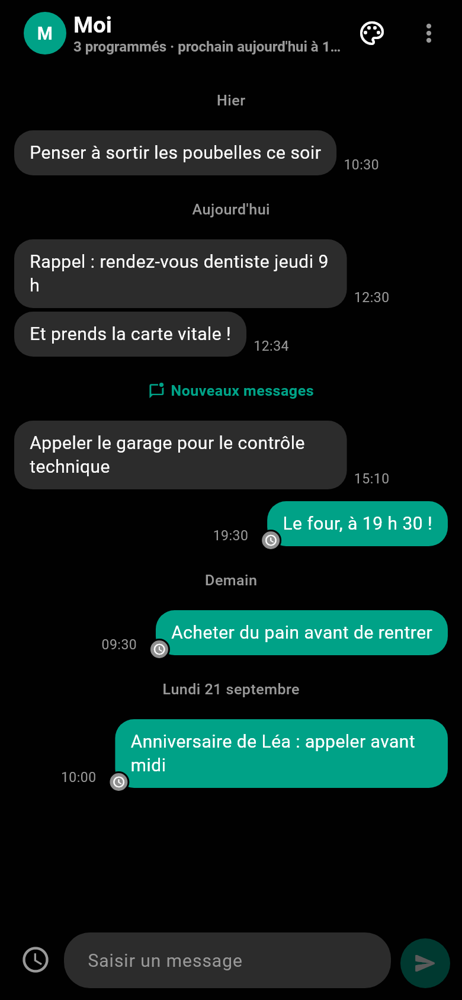
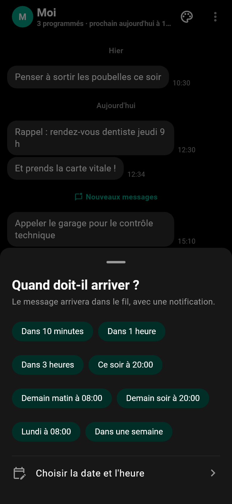
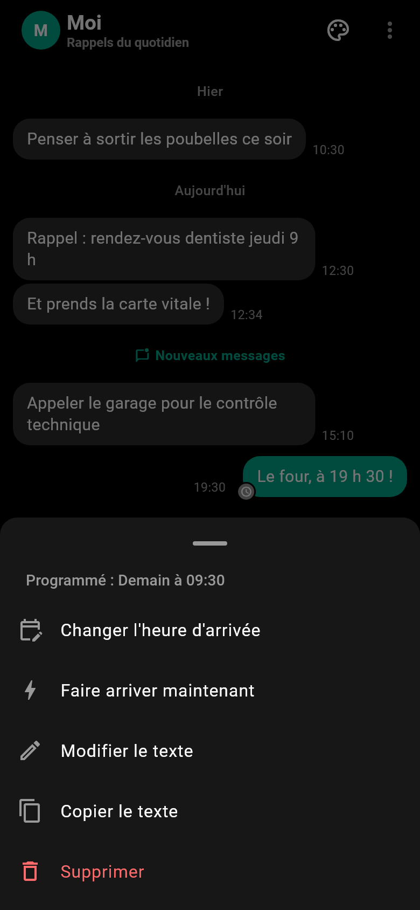
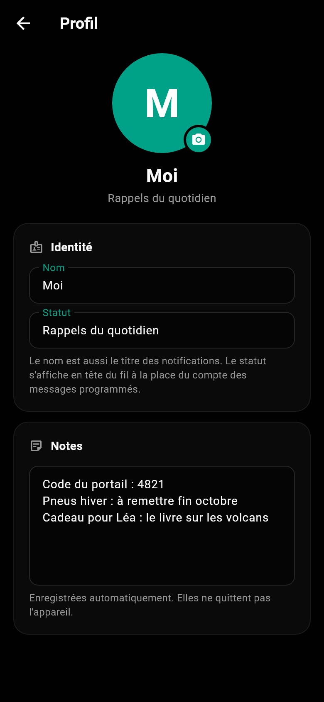
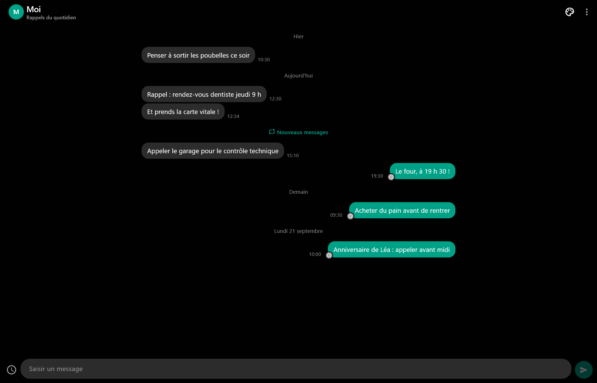
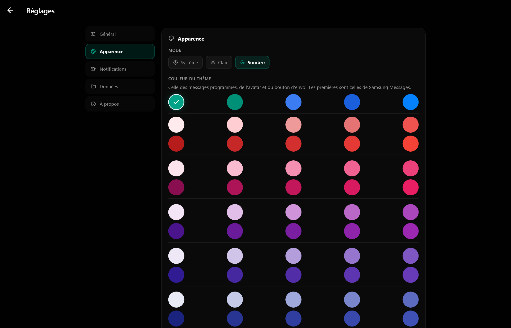

# Co-Rappelle

**Un fil de messages avec vous-même. Vous écrivez, vous choisissez l'heure, le
message arrive.**

Co-Rappelle est une application Windows et Android qui remplace les
pense-bêtes qu'on perd et les alarmes qu'on ne comprend plus. Vous vous
envoyez un message comme à un contact — « Appeler le garage », « Le four,
à 19 h 30 » — et il vous parvient à l'heure dite, avec une notification.

---

## Aperçu

*Le fil : les messages arrivés à gauche, ceux qui attendent leur heure à droite avec la pastille horloge, un séparateur par journée.*

*On écrit, on appuie sur envoyer : l'application demande quand le message doit arriver — dans une heure, ce soir, demain matin, lundi, ou une date précise.*

*Un message programmé se touche : changer l'heure, le faire arriver tout de suite, modifier le texte, copier, supprimer.*

*Mon profil : photo, nom, statut et notes à soi — comme la fiche d'un contact.*

*La même chose sur Windows : le fil, l'heure à côté de chaque bulle, la saisie en bas.*

*Les réglages sur Windows : mode clair ou sombre, couleur du thème (teintes Samsung, puis toute la grille Material).*

---

## Ce que ça fait

- **Un fil comme une conversation** : les messages arrivés en haut, classés
  par jour, les messages à venir en dessous avec leur heure en clair
  (« Demain à 08:00 · dans 14 h »). Un séparateur « Nouveaux messages »
  marque ce qui est arrivé depuis votre dernière visite.
- **Vous choisissez l'heure en un geste** — dans 10 minutes, dans 1 heure, ce
  soir, demain matin, lundi, dans une semaine — ou une date et une heure
  précises.
- **Un message à venir se modifie**, se reprogramme, se fait arriver tout de
  suite, se copie ou se supprime (avec annulation). Un message arrivé peut se
  renvoyer plus tard.
- **La notification est planifiée par le système** : elle part à l'heure
  choisie même si l'application est fermée, sans processus permanent. Sur
  Android, l'application demande une seule fois l'autorisation de notifier,
  au premier message.
- **Cinq palettes de couleurs** (Graphite par défaut), mode clair, sombre ou
  automatique ; le nom du fil se personnalise.

---

## Vos données restent chez vous

Aucun compte, aucun serveur, aucune publicité, aucune permission réseau. Les
messages sont enregistrés dans le dossier de données de l'application, nulle
part ailleurs ; « Supprimer tous les messages » les efface.

---

## Installation

- **Windows** : `corappelle-vX.Y.Z.exe`, installation dans votre profil, sans
  droit administrateur.
- **Android** : `corappelle-vX.Y.Z.apk`, Android 7.0 ou plus ; confirmez
  l'installation depuis une source extérieure.

Les versions sont publiées sur les [releases GitHub](../../releases) et dans
**Co-Menu**, la bibliothèque d'applications de Bicode_DEV, qui gère aussi les
mises à jour.

---

*Bicode_DEV — même famille que **Co-Menu**, **Co-Musique**, **Co-Craft**,
**Co-Santé** et **Arcanum.block**.*
